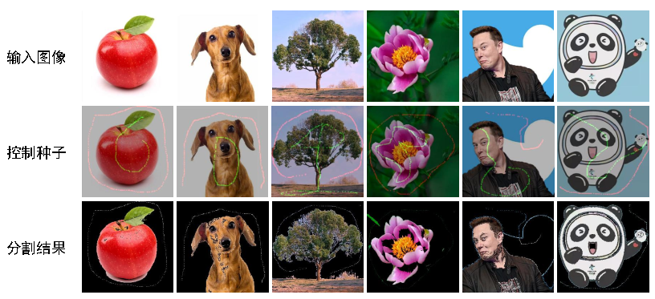

# GraphCuts

此仓库为中山大学高级算法设计与分析作业——基于最大流的图像分割。

## 使用

```python
python graphcut.py -i `处理文件名` -o `保存文件名`
```

## 交互

* `c`：清除前/背景种子
* `t`：交换绘制前/背景种子的模式
* `g`：创建容量网络并执行最大流算法
* `s`：保存分割结果
* `q`：推出程序

## 分割效果


